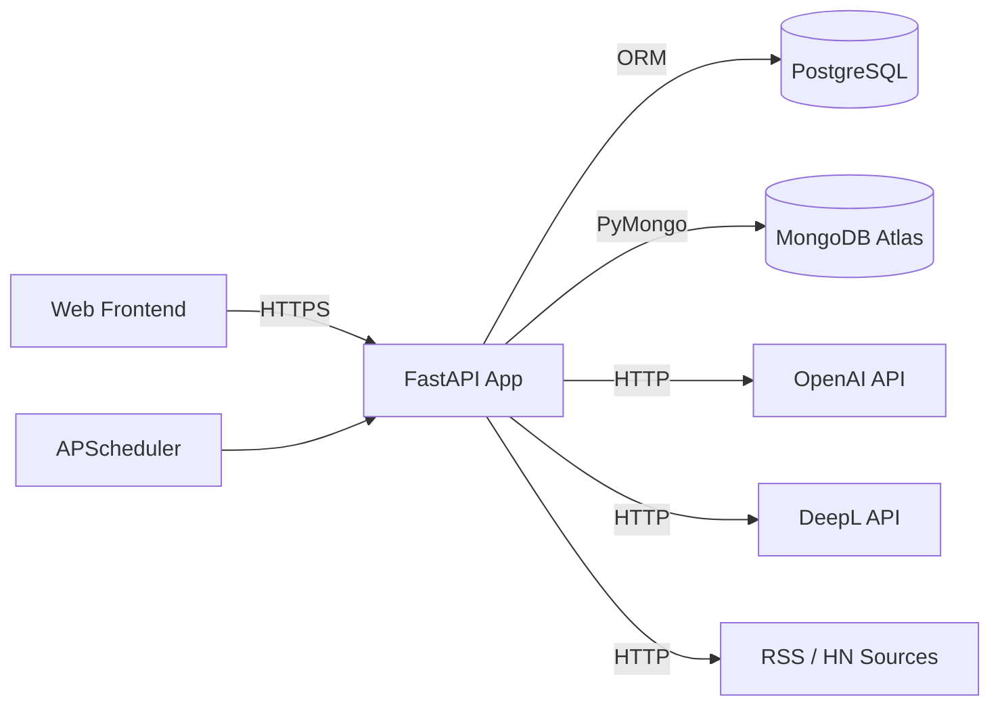
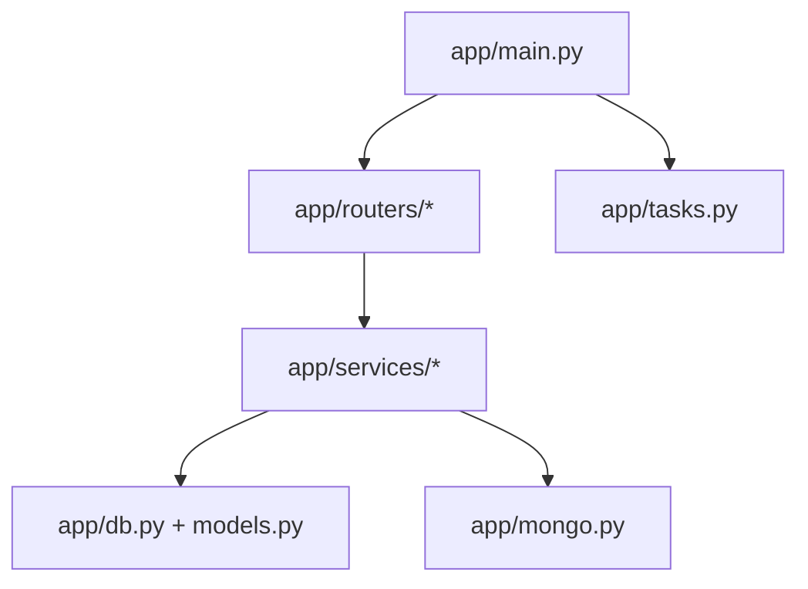

# System Overview

## 목적

`trend-frame-reader`는 외부 뉴스 소스를 수집/가공해 피드를 생성하고, 사용자 피드백과 북마크 기반 분석/질문응답 기능을 제공하는 백엔드입니다.

## High-Level Architecture

## Runtime Components

## 핵심 도메인

- Ingestion: RSS/HN 수집, 중복 제거, 번역/키워드 추출, 아이템 저장
- Feed: `Feed/FeedItem` 사전 생성(pre-generated) 후 `/feeds/today`로 노출
- Feedback/Event: `saved/skipped/liked/disliked`, `impression/click` 이벤트 적재
- Bookmark Intelligence: MongoDB 기반 그래프/키워드/타임라인/RAG
- Insights: 주간 인사이트 초안 생성/발행

## 슬롯 자동 선택 규칙

`GET /feeds/today`는 슬롯 파라미터 없이 서버가 자동 선택합니다.

- `AM`: 06:00 ~ 17:59 (KST)
- `PM`: 18:00 ~ 05:59 (KST)
- 우선 슬롯 피드가 없으면 반대 슬롯 fallback
