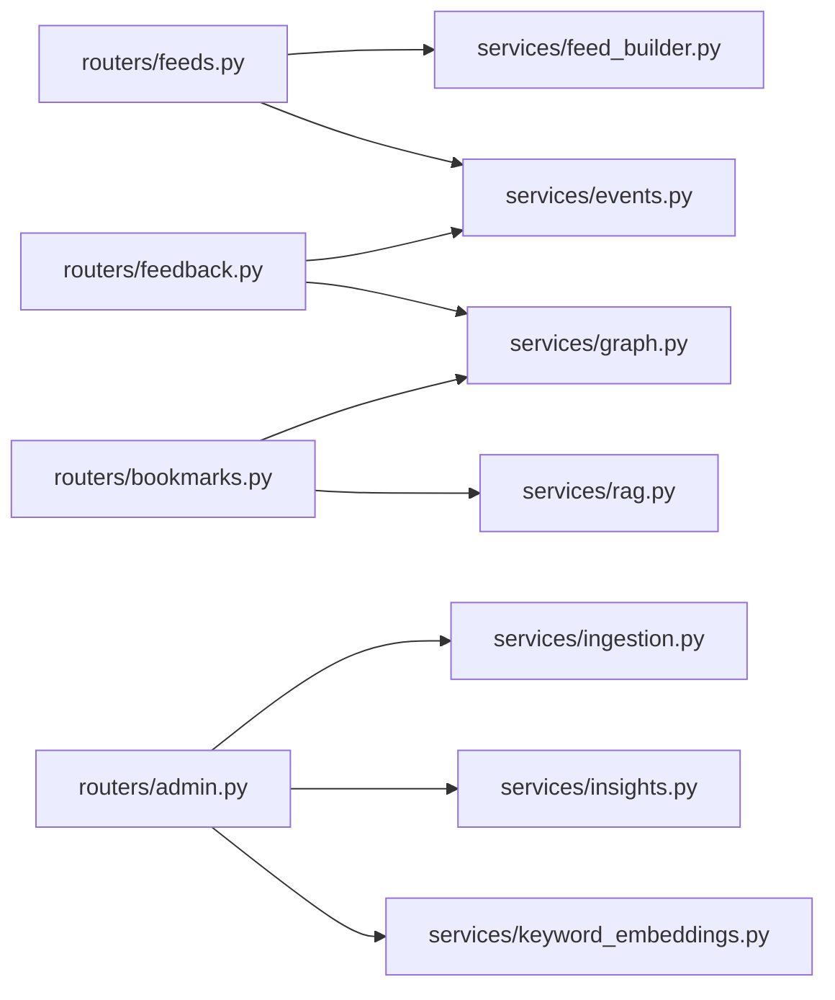

# Backend Structure

## Directory Map

```text
app/
  main.py                # 앱 부트스트랩, startup/shutdown, 라우터 등록
  config.py              # 환경변수 설정
  db.py                  # SQLAlchemy engine/session
  models.py              # PostgreSQL ORM 모델
  schemas.py             # Pydantic request/response 스키마
  security.py            # 인증/권한 의존성
  mongo.py               # MongoDB 클라이언트/컬렉션 헬퍼
  tasks.py               # APScheduler 작업 등록

  routers/
    health.py            # /health
    auth.py              # /auth/*
    feeds.py             # /feeds/today
    feedback.py          # /feedback
    events.py            # /events/click
    bookmarks.py         # /bookmarks/*
    insights.py          # /insights/posts*
    admin.py             # /admin/*

  services/
    ingestion.py         # RSS/HN 수집, item 저장
    feed_builder.py      # Feed/FeedItem 생성
    events.py            # feedback/event 컨텍스트 기록
    graph.py             # Mongo 그래프/클라우드/타임라인
    rag.py               # 북마크 기반 Q&A
    insights.py          # 인사이트 초안/발행
    auth.py              # JWT, Google OAuth 교환
    keywords.py          # 키워드 추출 헬퍼
    embeddings.py        # 임베딩 생성
    keyword_embeddings.py# 키워드 임베딩 백필/유사도
    ranking.py           # 아이템 점수 계산
    translation.py       # 제목 번역(DeepL)
    seeds.py             # seed 소스/스키마 보정
    utils.py             # 공통 유틸
```

## Router Responsibility

- `health`: DB 생존 확인
- `auth`: Google OAuth 로그인, 콜백, 현재 사용자, 로그아웃
- `feeds`: 오늘 피드 조회(슬롯 자동선택)
- `feedback`: 사용자 피드백 저장
- `events`: 클릭 이벤트 저장
- `bookmarks`: 북마크 목록, 그래프/키워드/타임라인, RAG Q&A
- `insights`: 발행된 인사이트 조회
- `admin`: 지표, 백필, 인사이트 관리, 키워드 임베딩 백필

## Service Dependency Shape



## Startup / Shutdown

- Startup (`main.py`)
  - DB ready 재시도(최대 20초)
  - `Base.metadata.create_all`
  - `apply_schema_upgrades`, `sync_seed_sources`
  - scheduler 시작
  - Mongo 인덱스 보장 시도
- Shutdown
  - scheduler 중지
  - Mongo 클라이언트 close
