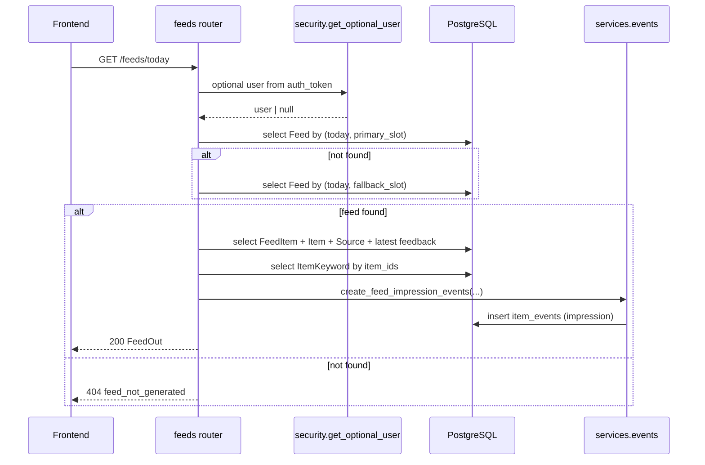
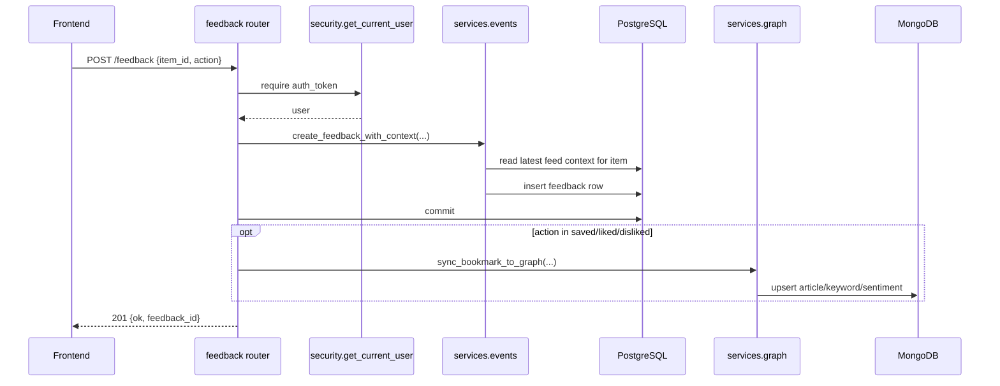
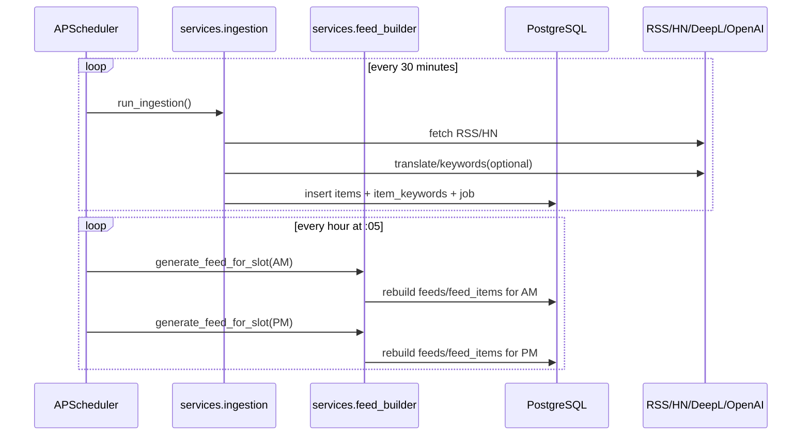
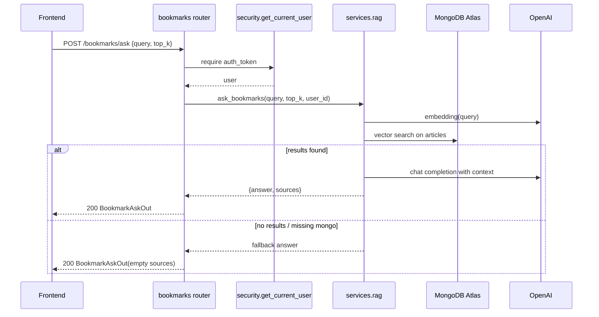

# Sequence Diagrams

## 1) Feed 조회 (`GET /feeds/today`)

```mermaid
sequenceDiagram
    participant FE as Frontend
    participant API as feeds router
    participant SEC as security.get_optional_user
    participant PG as PostgreSQL
    participant EVT as services.events

    FE->>API: GET /feeds/today
    API->>SEC: optional user from auth_token
    SEC-->>API: user | null

    API->>PG: select Feed by (today, primary_slot)
    alt not found
        API->>PG: select Feed by (today, fallback_slot)
    end

    alt feed found
        API->>PG: select FeedItem + Item + Source + latest feedback
        API->>PG: select ItemKeyword by item_ids
        API->>EVT: create_feed_impression_events(...)
        EVT->>PG: insert item_events (impression)
        API-->>FE: 200 FeedOut
    else not found
        API-->>FE: 404 feed_not_generated
    end
```

## 2) 피드백 저장 (`POST /feedback`)

```mermaid
sequenceDiagram
    participant FE as Frontend
    participant API as feedback router
    participant SEC as security.get_current_user
    participant EVT as services.events
    participant PG as PostgreSQL
    participant GR as services.graph
    participant MG as MongoDB

    FE->>API: POST /feedback {item_id, action}
    API->>SEC: require auth_token
    SEC-->>API: user

    API->>EVT: create_feedback_with_context(...)
    EVT->>PG: read latest feed context for item
    EVT->>PG: insert feedback row
    API->>PG: commit

    opt action in saved/liked/disliked
        API->>GR: sync_bookmark_to_graph(...)
        GR->>MG: upsert article/keyword/sentiment
    end

    API-->>FE: 201 {ok, feedback_id}
```

## 3) 스케줄러 작업 흐름

```mermaid
sequenceDiagram
    participant SCH as APScheduler
    participant ING as services.ingestion
    participant FB as services.feed_builder
    participant PG as PostgreSQL
    participant EXT as RSS/HN/DeepL/OpenAI

    loop every 30 minutes
        SCH->>ING: run_ingestion()
        ING->>EXT: fetch RSS/HN
        ING->>EXT: translate/keywords(optional)
        ING->>PG: insert items + item_keywords + job
    end

    loop every hour at :05
        SCH->>FB: generate_feed_for_slot(AM)
        FB->>PG: rebuild feeds/feed_items for AM
        SCH->>FB: generate_feed_for_slot(PM)
        FB->>PG: rebuild feeds/feed_items for PM
    end
```

## 4) 북마크 Q&A (`POST /bookmarks/ask`)

```mermaid
sequenceDiagram
    participant FE as Frontend
    participant API as bookmarks router
    participant SEC as security.get_current_user
    participant RAG as services.rag
    participant MG as MongoDB Atlas
    participant OA as OpenAI

    FE->>API: POST /bookmarks/ask {query, top_k}
    API->>SEC: require auth_token
    SEC-->>API: user

    API->>RAG: ask_bookmarks(query, top_k, user_id)
    RAG->>OA: embedding(query)
    RAG->>MG: vector search on articles
    alt results found
        RAG->>OA: chat completion with context
        RAG-->>API: {answer, sources}
        API-->>FE: 200 BookmarkAskOut
    else no results / missing mongo
        RAG-->>API: fallback answer
        API-->>FE: 200 BookmarkAskOut(empty sources)
    end
```
