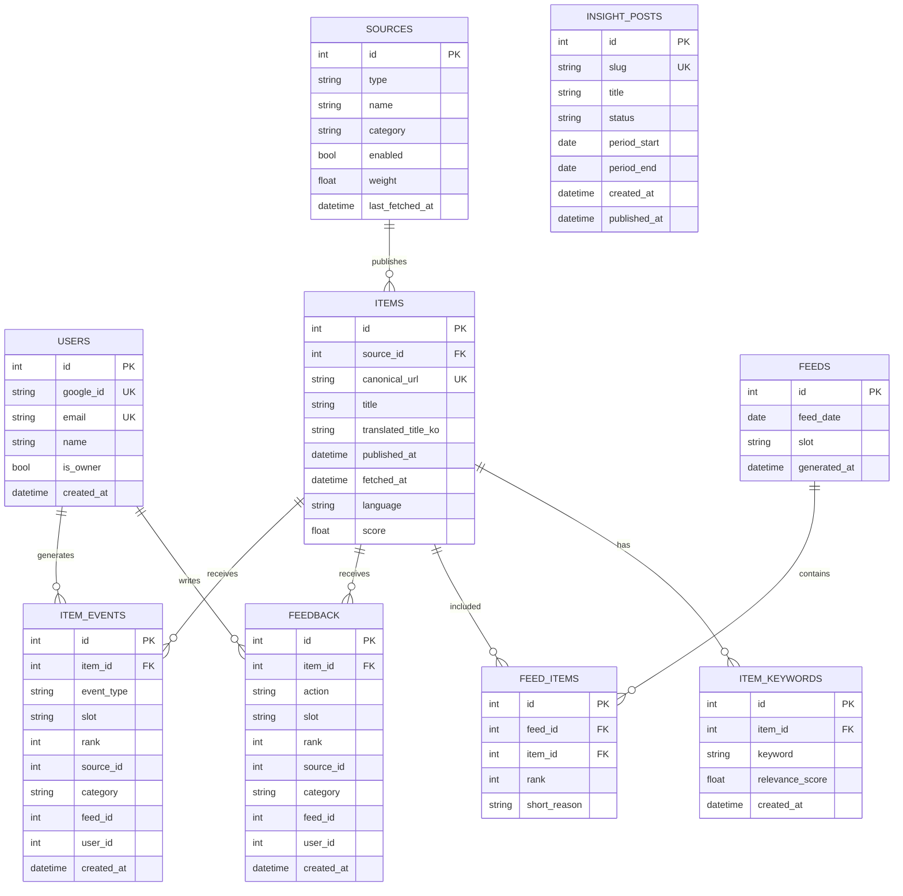

# Data Model

## PostgreSQL ER Diagram

## 핵심 제약

- `feeds`: `(feed_date, slot)` unique
- `feed_items`: `(feed_id, item_id)` unique
- `items.canonical_url` unique
- `users.google_id`, `users.email`, `insight_posts.slug` unique

## MongoDB Collections

- `articles`
  - 주로 북마크 기반 문서 저장(`item_id`, `title`, `summary`, `keywords`, `embedding`, `user_id`)
  - RAG/타임라인/그래프 아티클 노드 조회에 사용
- `keywords`
  - 키워드 집계(`doc_frequency`, `bookmark_frequency`, `cooccurrences`, `sentiment_score`, `embedding`)
  - 그래프 탐색/유사도 탐색에 사용
- `graph_sync_log`
  - 그래프 백필 시작/완료 이벤트 기록

## 이벤트 모델링 원칙

- `feedback`는 append-only 이벤트 저장
- `item_events`도 append-only(`impression`, `click`)
- 현재 상태는 "최신 row"를 집계해 계산
