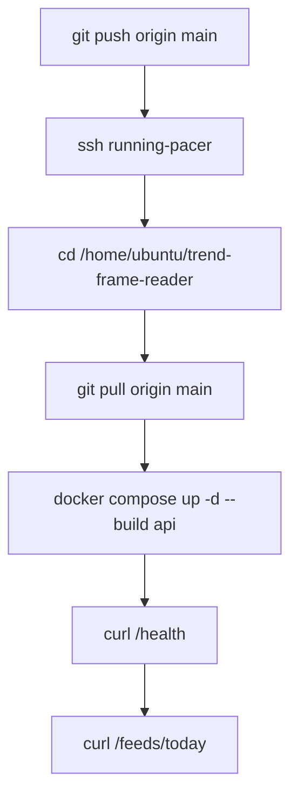

# Operations

## Run Modes

### Local

```bash
python -m venv .venv
source .venv/bin/activate
pip install -r requirements.txt
uvicorn app.main:app --reload
```

### Docker

```bash
docker compose up --build
```

## Deployment Flow (running-pacer)



## Scheduler Jobs

- `ingestion_30m`: 30분 주기
- `feed_hourly_refresh`: 매시 05분, AM/PM 모두 재생성

## API Permission Map

- Public
  - `GET /health`
  - `GET /feeds/today`
  - `GET /insights/posts`
  - `GET /insights/posts/{slug}`
  - `GET /auth/google/login`, `GET /auth/google/callback`
- Auth required (`auth_token`)
  - `POST /feedback`
  - `POST /events/click` (optional user 허용)
  - `GET /bookmarks*`, `POST /bookmarks/ask`
  - `GET /admin/keyword-sentiments`
  - `GET /auth/me`, `POST /auth/logout`
- Owner required
  - `POST /admin/run-ingestion`
  - `POST /admin/generate-feed/{slot}`
  - `GET /admin/metrics`, `GET /admin/user-stats`
  - `POST /admin/backfill-*`
  - `POST/PATCH/DELETE /admin/insights/*`
  - `POST /admin/keywords/backfill-embeddings`

## 주요 환경변수

- DB/서버
  - `DATABASE_URL`, `APP_TIMEZONE`, `CORS_ALLOWED_ORIGINS`
- 인증
  - `GOOGLE_CLIENT_ID`, `GOOGLE_CLIENT_SECRET`, `GOOGLE_REDIRECT_URI`
  - `JWT_SECRET`, `JWT_EXPIRE_DAYS`, `FRONTEND_URL`
- 관리자
  - `ADMIN_TOKEN`
- 외부 AI/번역
  - `OPENAI_API_KEY`, `OPENAI_KEYWORD_MODEL`, `OPENAI_EMBEDDING_MODEL`
  - `DEEPL_API_KEY`, `DEEPL_API_URL`
- 그래프/RAG
  - `MONGODB_URI`, `MONGODB_DATABASE`, `RAG_TOP_K`, `GRAPH_BACKFILL_BATCH_SIZE`

## 운영 시 체크 포인트

- `/feeds/today` 404 증가 시
  - scheduler 동작 여부 확인
  - `feeds` 테이블 당일 `am/pm` row 존재 여부 확인
- OAuth 오류 시
  - `GOOGLE_*`, `FRONTEND_URL`, 쿠키 `SameSite=None; Secure` 확인
- 그래프/RAG 비활성화 시
  - `MONGODB_URI` 미설정이면 관련 기능은 fallback 응답
