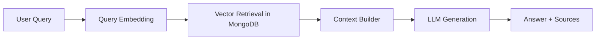
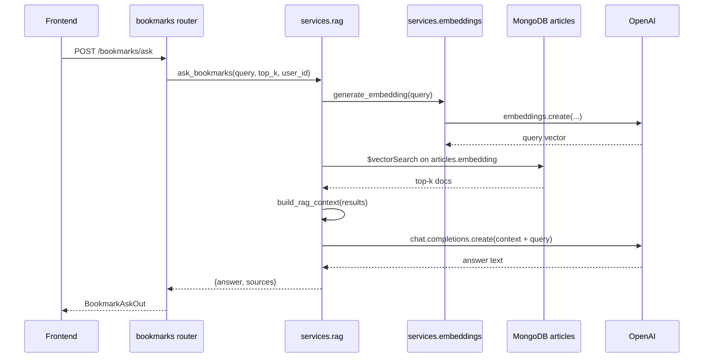

# RAG Study Guide (Project-Centric)

## 1. 이 프로젝트에서 RAG가 의미하는 것

이 프로젝트의 RAG는 "웹 전체"가 아니라 **사용자 북마크 집합**을 지식원으로 삼는 개인화 Q&A입니다.

- Retrieval 대상: MongoDB `articles` 컬렉션(북마크 문서)
- Generation 대상: OpenAI Chat Completions
- 질의 진입점: `POST /bookmarks/ask`

코드 시작점:
- `app/routers/bookmarks.py` -> `bookmark_ask()`
- `app/services/rag.py` -> `ask_bookmarks()`

## 2. RAG 파이프라인 개념



프로젝트 매핑:
- Query Embedding: `generate_embedding()` in `app/services/embeddings.py`
- Retrieval: `search_similar_bookmarks()` in `app/services/rag.py`
- Context Builder: `build_rag_context()` in `app/services/rag.py`
- Generation: `generate_rag_answer()` in `app/services/rag.py`

## 3. 실행 시퀀스



## 4. 중요한 구현 포인트

### 4.1 개인화 필터

`user_id`가 있으면 retrieval 파이프라인에서 `$match: {user_id}`를 추가합니다.

- 위치: `search_similar_bookmarks()`
- 의도: 내 북마크 기반 답변 보장

### 4.2 Atlas Vector Search 제약 대응

코드 주석 그대로, `user_id`를 벡터 인덱스 pre-filter로 넣지 못하는 경우를 고려해
후처리 필터를 염두에 둔 `fetch_limit`(top_k의 5배)을 사용합니다.

### 4.3 프롬프트 가드

`generate_rag_answer()`의 system prompt는 다음을 강제합니다.

- 프롬프트 유출 거부
- 역할 전환 시도 거부
- 컨텍스트 밖 정보 생성 금지

### 4.4 실패/폴백 설계

- OpenAI 임베딩 실패: `임베딩 생성에 실패했습니다.`
- retrieval 결과 없음: `관련 북마크를 찾지 못했습니다.`
- OpenAI 생성 실패: `답변 생성에 실패했습니다.`

즉, 기능 실패가 서비스 장애로 번지지 않도록 문자열 fallback을 제공.

## 5. 학습 체크리스트

1. 라우터 진입 확인: `bookmark_ask()`
2. `ask_bookmarks()`에서 top_k default(`settings.rag_top_k`) 확인
3. retrieval pipeline(`$vectorSearch` + `$match`) 확인
4. context 포맷이 답변 품질에 미치는 영향 확인
5. fallback 메시지 3종 발생 조건 확인

## 6. 직접 따라해보기

```bash
# 인증 쿠키가 있다고 가정
curl -sS -X POST http://localhost:8000/bookmarks/ask \
  -H 'Content-Type: application/json' \
  -d '{"query":"최근 AI 관련 뉴스 요약해줘","top_k":5}'
```

실험 포인트:
- `top_k=3/10`으로 바꿔 source 다양성 비교
- Mongo 비활성(`MONGODB_URI` 비움) 시 응답 비교
- OpenAI 키 제거 시 fallback 응답 확인

## 7. 이 프로젝트 RAG의 한계

- 지식원은 북마크에 한정(coverage 한계)
- context는 단순 텍스트 병합(고급 reranking 미적용)
- hallucination 방지 장치는 프롬프트 중심(검증 체인 없음)

다음 고도화 후보:
- re-ranker 도입
- source grounding 강제 포맷(JSON schema)
- answer confidence/abstention score 추가
