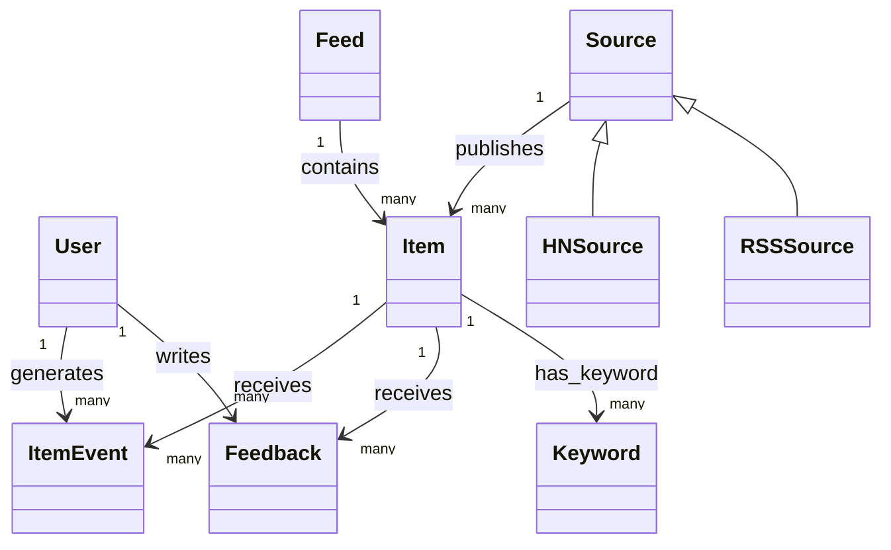
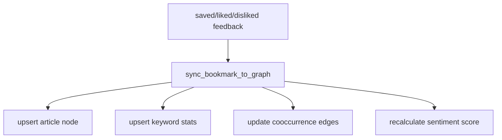

# Ontology & Knowledge Graph Study Guide

## 1. 온톨로지 vs 그래프를 이 프로젝트에 대입하기

- 온톨로지(Ontology): "무엇이 어떤 개념/관계인가"에 대한 개념 모델
- 지식그래프(KG): 그 모델을 실제 데이터(노드/엣지)로 구현한 결과

이 프로젝트는 명시적 OWL/RDF 온톨로지를 쓰진 않지만,
코드와 스키마에 **암묵적 온톨로지**가 존재합니다.

## 2. 암묵적 온톨로지(개념 계층)



코드 기준 개체:
- 관계형 모델: `app/models.py`
- 그래프 모델(문서형): `app/services/graph.py`, `app/mongo.py`

## 3. KG 저장 구조 (Mongo)

### 3.1 articles 컬렉션 (Article Node 성격)

대표 필드:
- `item_id`, `title`, `url`, `source`, `saved_at`, `keywords[]`, `embedding`, `sentiment`, `user_id`

### 3.2 keywords 컬렉션 (Keyword Node 성격)

대표 필드:
- `keyword`, `doc_frequency`, `bookmark_frequency`, `cooccurrences[]`, `sentiment_score`, `embedding`, `language`

### 3.3 cooccurrences (Keyword-Keyword Edge 성격)

- `cooccurrences: [{keyword, count}]`
- 의미: 두 키워드가 같은 기사에서 함께 등장한 빈도

## 4. 그래프 생성 규칙 (중요)



핵심 함수:
- `sync_bookmark_to_graph()`
- `_increment_keyword()`
- `_sync_cooccurrences()`
- `_recalculate_sentiment()`

즉, 온톨로지의 관계(`has_keyword`, `cooccurs_with`, `expresses_sentiment`)가
feedback 이벤트를 통해 점진적으로 materialize 됩니다.

## 5. 질의 관점 그래프 API

### 5.1 Co-occurrence Neighborhood
- `GET /bookmarks/explore`
- 구현: `get_keyword_graph()`
- 방식: BFS(depth) + 사용자 키워드 필터

### 5.2 Full Bipartite Graph
- `GET /bookmarks/graph`
- 구현: `get_full_graph()`
- 노드: keyword + article
- 엣지: `cooccurrence`, `has_keyword`

### 5.3 Similarity Graph (Embedding 기반)
- `GET /bookmarks/graph/similarity`
- 구현: `get_similarity_graph()`
- 엣지: `similarity`, `has_keyword`
- Atlas Vector Search 실패 시 in-memory cosine fallback

## 6. 온톨로지 관점에서 읽는 ER + KG 연결

```mermaid
flowchart LR
    PG[(PostgreSQL Events)] -->|saved/liked/disliked| MAP[Ontology Mapping Rules]
    MAP --> MG1[(Mongo articles)]
    MAP --> MG2[(Mongo keywords)]
    MG2 --> API1[/bookmarks/explore]
    MG2 --> API2[/bookmarks/graph/similarity]
    MG1 --> API3[/bookmarks/timeline]
    MG1 --> API4[/bookmarks/ask]
```

해석 포인트:
- PostgreSQL은 "사실 이벤트 로그"
- Mongo는 "질의 최적화된 지식 표현"

## 7. 학습 루트 (코드 추적 순서)

1. `app/models.py`에서 엔티티 관계 파악
2. `app/services/events.py`로 이벤트 컨텍스트 파악
3. `app/services/graph.py`에서 이벤트->그래프 변환 규칙 파악
4. `app/routers/bookmarks.py`에서 질의 API 표면 확인
5. `app/services/keyword_embeddings.py`로 의미 유사도 계층 확인

## 8. 개념적으로 개선해볼 주제

- 명시적 ontology layer 도입
  - 예: relation type enum/registry를 별도 모듈로 분리
- temporal ontology
  - 키워드 관계의 시간가중치(최근성) 반영
- provenance ontology
  - edge/node가 어떤 feedback/event로 생성됐는지 추적 가능화

## 9. 실전 체크 질문

- `saved`와 `liked`는 같은 의미인가, 다른 관계인가?
- `cooccurrence count`가 높다는 것이 "의미적으로 유사"를 보장하는가?
- personalization 필터를 어디에 거는 것이 ontology 일관성에 유리한가?
- KG 스키마 변경 시 기존 백필 전략은 어떻게 설계해야 하는가?
